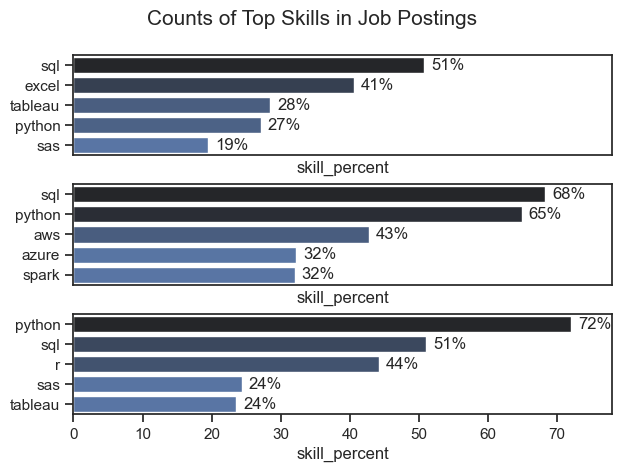
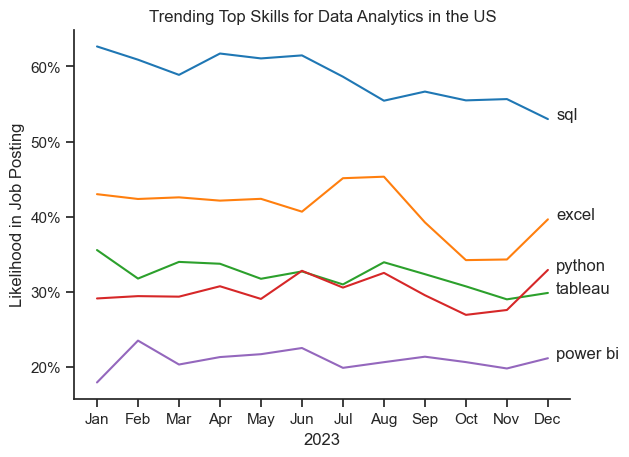
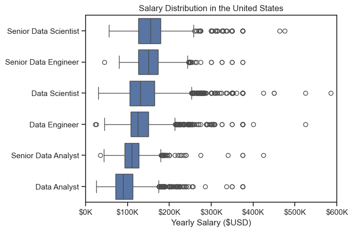
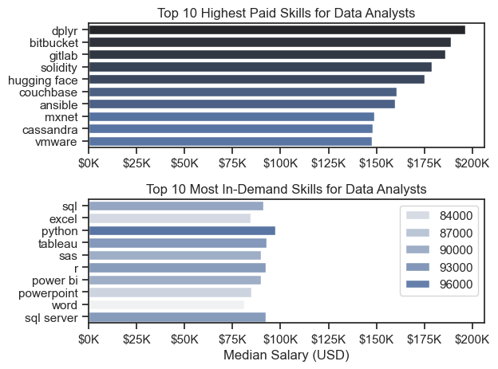
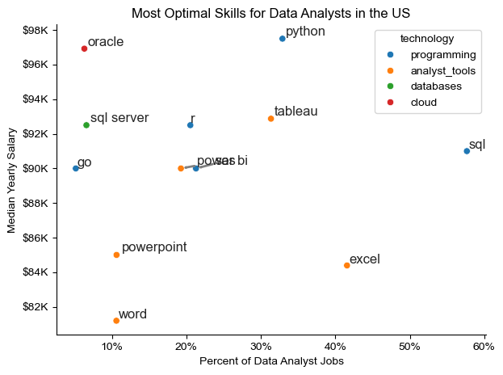

# The Analysis

## 1. What are the most demanded skills for the top 3 most popular data roles ?

To find the most demanded
skills for the top 3 most popular data roles. I filtered out those positions by which ones were the most popular, and got the top 5 skills for these top 3 roles.
This query highlights the most popular job titles and their top skills showing which should pay attention to depending on the role I'm targeting:

View my notebook with detailed steps here: [2_Skill_Demand.ipynb](3_Project/2_Skills_Count.ipynb)

### Visualize Data

```python
fig, ax = plt.subplots(len(job_titles), 1)

sns.set_theme(style='ticks')
for i, job_title in enumerate(job_titles):
    df_plot = df_skills_perc[df_skills_perc['job_title_short'] == job_title].head(5)[::-1]
   
    sns.barplot(data=df_plot , x='skill_percent', y='job_skills', ax=ax[i], hue='skill_count', palette='dark:b_r')

plt.show()
```

### Results



### Insights

Python is a versatile skill, highly demanded Lacross all three roles, but most prominently for Data Scientists (72%) and Data Engineers (65%) - 
- SQL is the most requested skill for Data Analysts and Data Scientists, with it in over half the job postings both roles. For Data!
Engineers Python is the most sought-after skill, appearing in 68% of job postings. Data Engineers require more specialized technical skills (AWS, Azure, Spark) compared to Data Analysis Scientists who are expected to be proficient in more general data management and analysis tools


### Visualize Data

### Results



*Bar graph visualizing the trending top skills for data analysts in the US in 2023.*

### Insights

* SQL remains the most in-demand skill throughout the year
    👉 It consistently stays above 55–63%, making it the top required skill for data analysts in the US.

⸻

* Excel shows fluctuation but stays strong
    👉 It starts around ~43%, peaks mid-year (~45%), drops in Oct-Nov, and rises again → showing consistent but slightly unstable demand.

⸻

* Python and Tableau show moderate but stable growth
    👉 Both stay around 30–33% range, indicating they are important supporting skills, but not as dominant as SQL or Excel.

# The Analysis

## 3. How well do jobs and skills pay for Data Analyst

sns.boxplot(data=df_US_top6, x='salary_year_avg', y='job_title_short', order=job_order)
sns.set_theme(style='ticks')

ticks_x = plt.FuncFormatter(lambda y, pos: f'${int(y/1000)}K')
plt.gca().xaxis.set_major_formatter(ticks_x)
plt.show()

#### Results 


*Box plot visualizing the salary distribution for the top 6 data job titles. *


# The Analysis

## 3. How well do jobs and skills pay for Data Analyst
### Highest Paid & Most Demanded Skill for Data
#### Visualize Data

```python

fig, ax = plt.subplots(2, 1)

# Top 10 Highest Paid Skills for Data Analysis
sns.barplot(data=df_DA_top_pay, x='median', y=df_DA_top_pay.index, ax=ax[0], hue='median', palette='dark:b_r')

# Top 10 Most In-Demand Skills for Data Analysts
sns.barplot(data=df_DA_skills, x='median', y=df_DA_skills.index, ax=ax[1], hue='median', palette='light:b')

plt.show()

```


*Two separate bar graphs Visualizing the highest paid skills and most in-demand skills for data analysis in the US*

# The Analysis
## 3. How well do jobs and skills pay for Data Analyst
### Highest Paid & Most Demanded Skill for Data
#### Insights:

* High-paying skills are very different from in-demand skills

Top-paying skills like dplyr, gitlab, solidity are not in the most in-demand list, meaning niche skills pay more but are less required.

⸻

* Python is the most in-demand but not the highest paying
 
 Python ranks #1 in demand, but it doesn’t appear in top-paying skills → shows it’s a must-have baseline skill, not a premium niche skill.

⸻

* Business tools (Excel, Power BI, SQL) dominate demand but offer moderate salaries

 These tools appear in demand chart but not in top salary chart → they are essential for jobs, but don’t give highest pay compared to specialized tools.

# The Analysis
## 4. What is the most optimal skill to learn for Data Analyst ?

#### Visualize Data

```python
from adjustText import adjust_text
import matplotlib.pyplot as plt

plt.scatter(df_DA_skills_high_demand
['skill_percent'], df_DA_skills_high_demand
['median_salary'])
plt.show

```


# The Analysis
## 4. What is the most optimal skill to learn for Data Analyst ?

#### Results


*A scatter plot visualizing the most optimal skills (high paying & high demand) for data analysts in the US*

# The Analysis
## 4. What is the most optimal skill to learn for Data Analyst ?

#### Insights

📊 Key Insights

* SQL is the most demanded skill but not the highest paying
    👉 It has the highest job percentage (58%) but salary is moderate ($91K) → high demand, average pay

⸻

* Python offers the best balance of demand and salary
    👉 Good demand (32%) and high salary ($98K) → most optimal skill overall

⸻

* Cloud & niche tools (like Oracle) pay higher but have low demand
    👉 High salary (~$97K) but very low job percentage (~7–10%) → high pay, low opportunities

⸻

* Basic tools (Excel, Word, PowerPoint) have lower salaries
    👉 Even with decent demand, salaries stay low (~$82K–$85K) → entry-level / support tools 